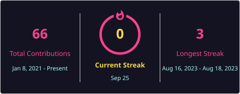

<h1 align="center">Hi 👋, I'm Mohit Fating</h1>
<h3 align="center">AI/ML Developer</h3>

  

---

### 🚀 About Me
- 🧠 Working across **Data Engineering, Machine Learning, and Quantitative Finance**
- 🔭 Currently building and experimenting with AI/ML driven tools and trading systems
- 🌱 Always exploring new ideas in ML, data pipelines, and cloud platforms
- ✍️ I occasionally write on **Medium**

---

### 🔗 Connect with Me

  
  
  
  
  

---

### 🛠️ Languages & Tools

  
  
  
  
  
  
  

---

  

  

